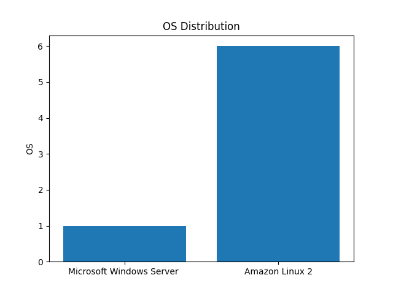
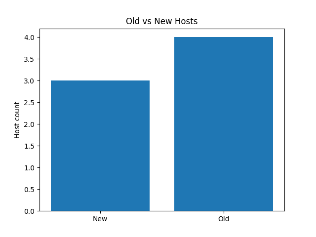

# Silk

### Running the project

- Copy the .env.example to .env file and populate the environment variables

- Run commands below in your shell:
  - pip install uv
  - uv python install 3.10
  - uv sync
  - uv run python -m silk

### Distribution of Hosts by OS

### Old vs New Hosts

